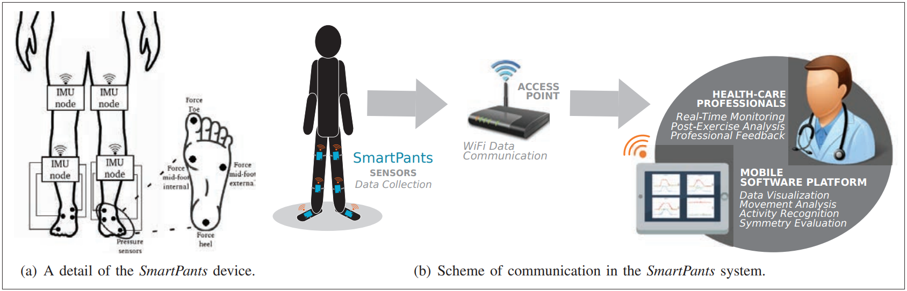

# Inferring Feet Pressures with Lower Limbs IMUs (DATASET)

The prediction of foot pressure using IMU sensors is an active area of research aimed at minimizing hardware, cost, and 
logistics while enhancing the degree of freedom for Internet of Medical Things (IoMT) in health assessment and monitoring 
of post-stroke rehabilitation patients.

This dataset is collected from eight real hospital patients undergoing post-stroke rehabilitation at various stages. 
The data is gathered by an expert physiotherapist during therapy sessions while the patients wear SMARTPant[1], a platform
that includes four IMU sensor nodes placed on the lower limbs, along with two pressure-sensing insoles, each equipped with
four piezoelectric pressure-sensing nodes deployed at four key points on the foot, as shown in Figure 1.



<sub> Image was adapted from [1] 
https://ieeexplore.ieee.org/abstract/document/8938180 </sub>

##Particular aspects of dataset are:

* [ ] The dataset is composed of eight real patients from two different hospitals in a metropolitan area, all undergoing the post-stroke rehabilitation phase and at various stages.
* [ ] The patients perform physiotherapy exercises under the supervision of trained physiotherapists while wearing these wearables.
* [ ] Data is periodically captured weekly to monitor the recovery phase and adapt the therapy protocols for up to six weeks.
* [ ] The duration of some complex exercises varies for different users, depending on their health conditions.  
* [ ] The participants were free from other musculoskeletal or neurodegenerative diseases.
* [ ] The same hardware platform is utilized for all patients.


# Dataset Details

## Directory structure

* ----BasePath
* ------------SmartPant_Dataset
* -----------------------------Hospital_Name
* ------------------------------------------Patient_Identifier
* -----------------------------------------------------------Session_date
* -----------------------------------------------------------------------Exercise_type										   

## Files List for each exercise
SMARTPant contains four sensory nodes, so four separate CSV files will be saved. 
* Exercise type Left Shinbone
* Exercise type Left Tight
* Exercise type Right Shinbone
* Exercise type Right Tight

## Data structure in each file

Each record in the generated csv file is in the form of:
```
A_xyz, G_xyz, M_xyz, FPV, DeltaT, T_abs
```
, with each item described in the following:
| name  | dimention | description | 
| :---: | :---------: | :---------: |
| A_xyz | GNSS time of the navigation epoch (expressed as Unix timestamp in ns) |
| G_xyz | The x, y, z component of the position in ECEF frame |
| M_xyz | The x, y, z component of the velocity in ENU frame |
| FPV   | GNSS fix type (0=no fix, 1=dead reckoning only, 2=2D-fix, 3=3D-fix, 4=GNSS+dead reckoning combined, 5=time only fix) |
| DeltaT| if fix valid (1=valid fix) |
| T_abs | if differential correction were applied (1=applied) | 

# How to user
Download the repository and extract the SmartPant_Dataset.rar file using the following command in Linux or with WinRAR software in Windows.

```
sudo apt-get install unrar
unrar x SmartPant_Dataset.rar /path/to/directory 
```

## License
The dataset is released under [CC-BY-NC-SA-4.0](https://creativecommons.org/licenses/by-nc-sa/4.0/) license.

## When using this dataset for your research, please cite the related papers in your publication:
```
comming soon
```
```
@article{bisio2019ehealth,
  title={When eHealth meets IoT: A smart wireless system for post-stroke home rehabilitation},
  author={Bisio, Igor and Garibotto, Chiara and Lavagetto, Fabio and Sciarrone, Andrea},
  journal={IEEE Wireless Communications},
  volume={26},
  number={6},
  pages={24--29},
  year={2019},
  publisher={IEEE}
}
```
## Reference 
[1] Bisio, Igor, et al. "When eHealth meets IoT: A smart wireless system for post-stroke 
home rehabilitation." IEEE Wireless Communications 26.6 (2019): 24-29.
